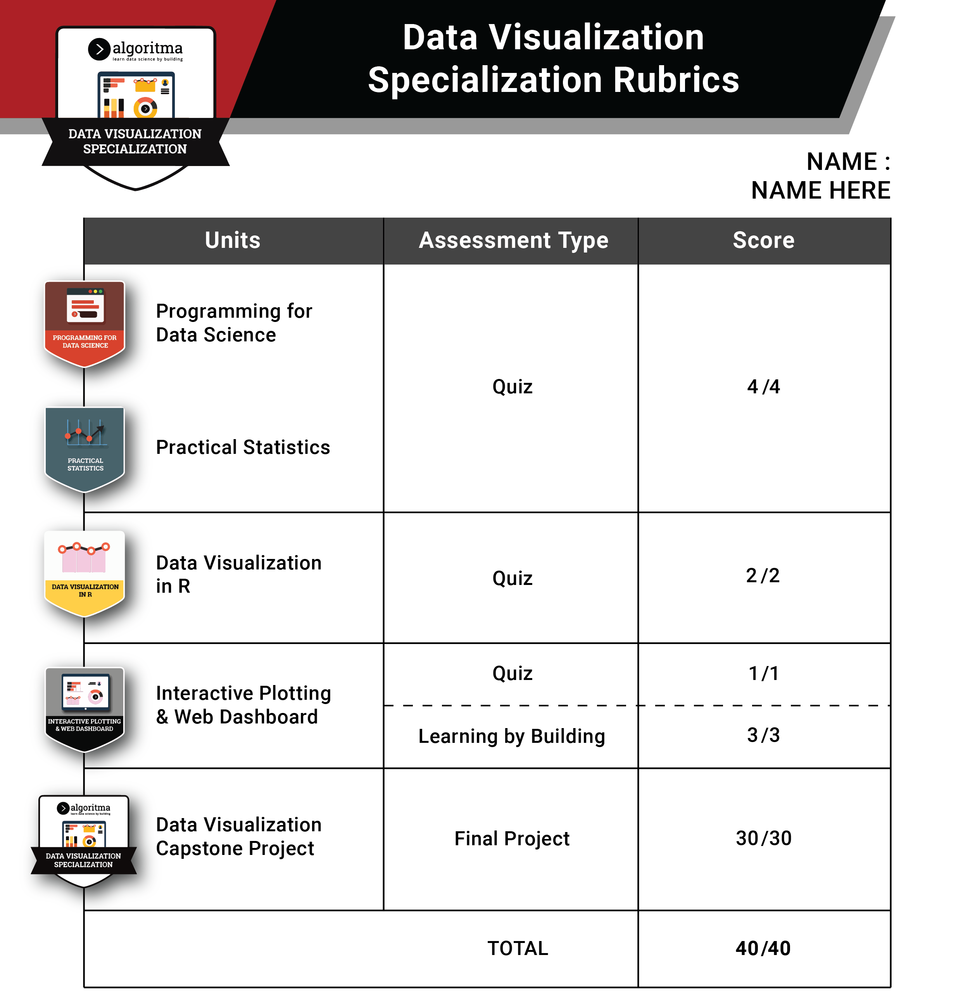
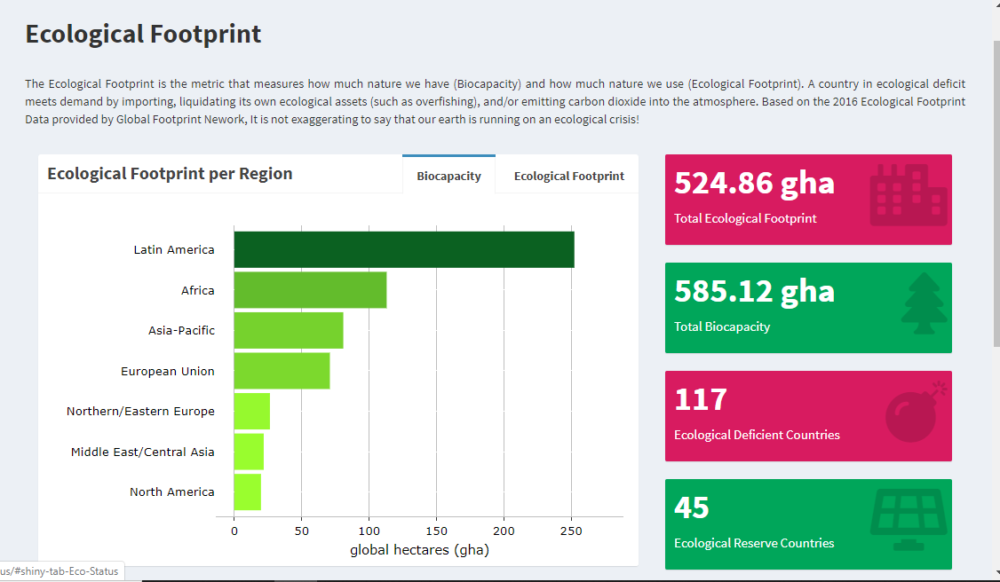
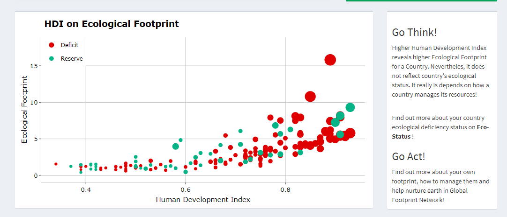
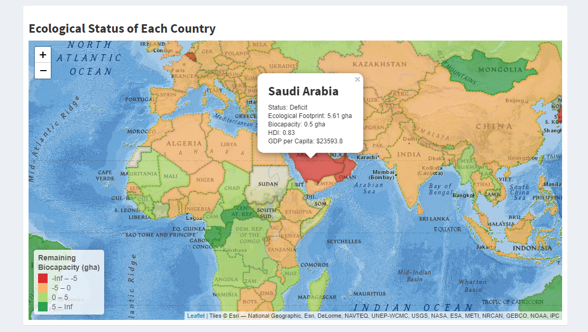
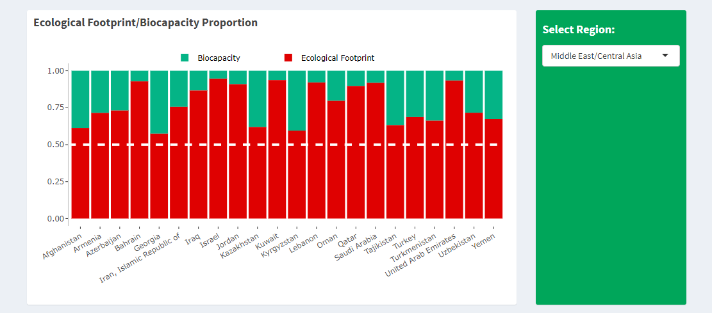
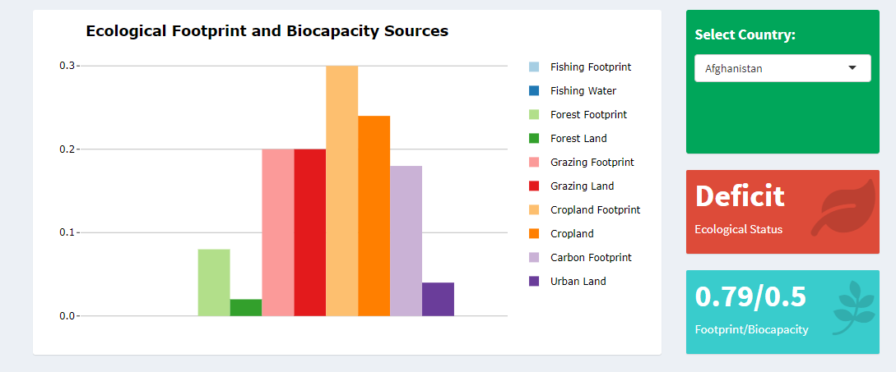
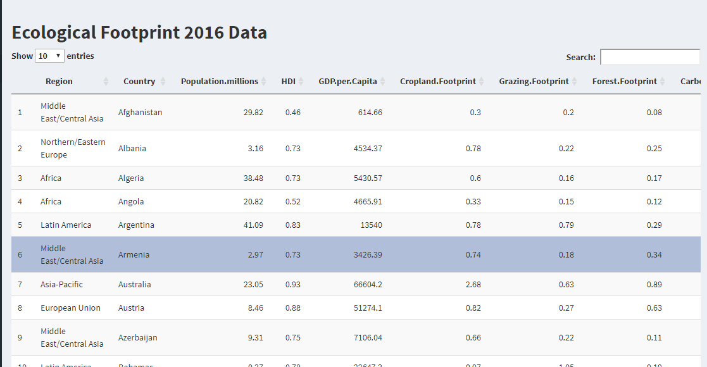

# Algoritma

Algoritma is a data science education center based in Jakarta. We organize workshops and training programs to help working professionals and students gain mastery in various data science sub-fields: data visualization, machine learning, data modeling, statistical inference etc. Visit our website for all upcoming workshops.

# Libraries and Setup

We’ll set-up caching for this notebook given how computationally expensive some of the code we will write can get.

```{r setup}
options(width=50)
knitr::opts_chunk$set(cache = F,tidy=TRUE)
options(scipen = 9999)
rm(list=ls())
```

You will need to use `install.packages()` to install any packages that are not already downloaded onto your machine. You then load the package into your workspace using the `library()` function:

```{r results='hide', message=FALSE}
library(dplyr)
library(tidyr)
library(ggplot2)
library(plotly)
library(reshape2)
library(leaflet)
```

# Data Visualisation Capstone Project

After having learned and explored appropriate techniques on visualizing data, students are required to deploy an interactive dashboard web application using a shiny server which contain any plotting objects such as ggplot and/or leaflet that display useful insights.

## First Objective

Before you making the dashboard, let's answer this question first to help you creating a dashboard with useful insight.

### What  

What is the dashboard about? 

This question is self explanatory, you should know what is it about, what problem you try to solve with this dashboard, what story you try to tell to your audience.

### Who 

Who is the user of your dashboard? 

Knowing the user of your dashboard is very important. What division or what kind of people using this dashboard. Do you need a detail or more practical dashboard? When your user is on operational level you need a detailed dashboard but when your user is on managerial level you need simple and general dashboard that can convey the insight quickly. 


### Why 

Why you choose that data? 

How much your understanding of that data, Is that data can solve your question? Why do you choose that variable, are they really corelated? Important to know why your choose that data so you don't create a misleading insight which very dangerous. 

### When 

When is the data collected? 

Is it still relevant? For example You can't use the data from 80s to describe how's the traffic at current date. Since the trend is everchanging so does the answer to your question, can those very old data answer your question? Irrelevant data can create a misleading insight. 

### Where 

Where you put your plot, valuebox, or input etc? 

Make a simple layout design, so you have a image how your end product will look like. Is it tidy enough? Easy enough for your user to understand it? Always follow 5 seconds rule. Your dashboard should provide the relevant information in about 5 seconds.

### How 

How your dashboard answer your question, hypothesis, or problem you try to solve?

Are you using a right plot? A right variable? Always start from your problem, make sure you use a right plot for right problem. For example what plot you use for see your data distribution? Are you using density plot or line plot? 

## Rubrics

In addition, students are given the freedom to use their own dataset or past datasets from previous classes. Below are the rubrics for assessment and grading, Students will get the point(s) if they :

### Input (reactivity)

- (2 points) Using min. 2 different input type 
- (2 points) Choosing appropriate input type 
- (2 points) Demonstrating useful input(s) 
  
### Tab (paging)

- (3 points) Using min. 3 page 
  
### Render plot 

- (1 points) Using interactive plot
- (2 points) Using min. 2 plot type
- (2 points) Choosing the appropriate plot type 
- (2 points) Demonstrating reactivity from the input
- (2 points) Creating plots that tell a clear story 
  
### Deploy 

- (6 points) Successfully deploying to shinyapps.io 

### User Interface Appearence

- (2 points) Have tidy page layout
- (2 points) Have tidy plot layout
- (1 points) Have appropriate plot tooltip
- (1 points) Choosing right color scheme 

If you achieved all those criteria you will get total 30 points. 



## Reference

- Shiny Dashboard
https://rstudio.github.io/shinydashboard/

- Shiny Rstudio
https://shiny.rstudio.com/gallery

- tychobra
https://www.tychobra.com/shiny/

- Algotech: Articles tagged Shiny
https://algotech.netlify.app/tags/shiny/

Demo from Algoritma : 

- Advisory - Samuel Chan
https://github.com/onlyphantom/advisory

- Workforce - Tiara
https://github.com/tiaradwiputri/workforce

- Ecological Footprint - Nabiilah:
https://github.com/NabiilahArdini/Eco-Status

## Data Source

Some data source reference:

- Kaggle http://kaggle.com
- TidyTuesday https://github.com/rfordatascience/tidytuesday
- UCI Machine Learning Repository http://archive.ics.uci.edu/ml/index.php is a dataset specifically pre-processed for machine learning.
- Data.gov http://data.gov The US Government pledged last year to make all government data available freely online.
- US Census Bureau http://www.census.gov/data.html A wealth of information on the lives of US citizens covering population data, geographic data and education.
- European Union Open Data Portal http://open-data.europa.eu/en/data/ As the above, but based on data from European Union institutions.
- Data.gov.uk http://data.gov.uk/ Data from the UK Government, including the British National Bibliography – metadata on all UK books and publications since 1950.
- Indonesia version Government : http://data.go.id
- Jakarta open data http://data.jakarta.go.id/
- Badan Pusat Statistik : https://www.bps.go.id/


## Tips
- Set your size.
By default, Shiny limits file uploads to 5MB per file. You can modify this limit by using the shiny.maxRequestSize option. For example, adding this to the top of app.R would increase the limit to 200MB.


`options(shiny.maxRequestSize=200*1024^2)`


- Use RDS for save your files.

`saveRDS()`

`readRDS()`

# Planning Your Project

You can start to work and plan your project after the briefing end. We expect you can finish answering the first objective today so you can focus on building the shiny dashboard for the rest of the week. 

## Estimated Time 

Below is our estimated time to finish answering the first objective (5W+1H questions) during the briefing day.

```{r echo=FALSE}
data.frame(Questions = c("What", "Who", "Why and When", "How", "Where", "Present the Result"),
           Time = c(10, 10, 40, 30, 30, 15))
```

## Example

Below is our example of answering the 5W+1H questions above. 

### What (ETC: 10 Mins)

I want to show how every country around the world manages its natural resources, shown by the value of **Ecological Footprint** and **Biocapacity** of these countries.

A country experiencing **Ecological Deficit** is indicated by the behavior of that country that imports **Biocapacity** through trade, liquidation of national ecological assets or emits a lot of carbon dioxide emissions into the air. Meanwhile, countries are said to have **Ecological Reserves** when **Biocapacity** (how many natural resources are owned) exceeds **Ecological Footprint** (how many natural resources are used). Thus, countries that have **Ecological Footprint** bigger than **Biocapacity** have the potential to suffer from various ecological impacts such as natural disasters, land damage, loss of biodiversity, and other things that can have negative impacts on the environment and the country's economy.

For this project, I specifically want to:

* Increase awareness among people toward the ecological status of their country
* Show the relation between human development index with the ecological footprint of the country to see if country with higher human resource index would also have higher ecological footprint
* Provide ecological status and other metrics that can shows ecological activity of each country in the world

### Who (ETC: 10 Mins)

This dashboard is created as a medium of education for common people regarding usage and preservation of countries natural resources.

### Why and When (ETC: 40 Mins)

The dataset that is suitable for this project is the ecological data acquired from Global Footprint Network (http://data.footprintnetwork.org/). The data was updated on August 12, 2019 so it is still relevant with the current condition. 

```{r}
footprint <- read.csv("data_input/countries.csv")

footprint <- footprint %>% 
  mutate(Country = as.character(Country),
         GDP.per.Capita = as.numeric(gsub("[$,]","", footprint$GDP.per.Capita)),
         HDI = round(HDI, 2),
         Countries.Required = round(Countries.Required, 2),
         Biocapacity.Deficit = as.factor(ifelse(Biocapacity.Deficit>0, "Reserve", "Deficit"))) %>%
  rename(Status = Biocapacity.Deficit) %>% 
  select(-c(Data.Quality)) %>% 
  drop_na()

footprint
```

### How (ETC: 30 Mins)

Explain how to achieve each goals or purposes stated on `What` question.

* Increase awareness among people toward the ecological status of their country

I will create a plot that shows the **Ecological Footprint** and **Biocapacity** for each region.

```{r}
ef_region <- footprint %>% 
            group_by(Region) %>% 
            summarize(Ecological.Footprint = sum(Total.Ecological.Footprint)) %>% 
            arrange(desc(Ecological.Footprint)) %>% 
            mutate(text = paste0("Ecological Footprint: ", Ecological.Footprint, " gha"))
        
        ef_reg_plot <- ggplot(ef_region, aes(x=reorder(Region, Ecological.Footprint), y=Ecological.Footprint, text = text)) +
            geom_col(aes(fill=Ecological.Footprint), show.legend = F) +
            coord_flip() +
            labs(title = "Ecological Footprint by Region",
                 y = "global hectares (gha)",
                 x = NULL) +
            scale_y_continuous(limits = c(0, 150),
                           breaks = seq(0,150, 25)) +
        scale_fill_gradient(low = "#F78181", high = "#3B0B0B") +
        theme(plot.title = element_text(face = "bold", size = 14, hjust = 0.04),
              axis.ticks.y = element_blank(),
              panel.background = element_rect(fill = "#ffffff"), 
              panel.grid.major.x = element_line(colour = "grey"),
              axis.line.x = element_line(color = "grey"),
              axis.text = element_text(size = 10, colour = "black")
        )
    
    ggplotly(ef_reg_plot, tooltip = "text")
```

```{r}
b_region <- footprint %>% 
        group_by(Region) %>% 
        summarize(Biocapacity = sum(Total.Biocapacity)) %>% 
        arrange(desc(Biocapacity)) %>% 
        mutate(text = paste0("Biocapacity: ", Biocapacity, " gha"))
    
    b_reg_plot <- ggplot(b_region, aes(x=reorder(Region, Biocapacity), y=Biocapacity, text = text)) +
        geom_col(aes(fill=Biocapacity), show.legend = F) +
        coord_flip() +
        labs(title = "Biocapacity by Region",
             y = "global hectares (gha)",
             x = NULL) +
        scale_y_continuous(limits = c(0, 275),
                           breaks = seq(0,250, 50)) +
        scale_fill_gradient(low = "#9AFE2E", high = "#0B6121") +
        theme(plot.title = element_text(face = "bold", size = 14, hjust = 0.04),
              axis.ticks.y = element_blank(),
              panel.background = element_rect(fill = "#ffffff"), 
              panel.grid.major.x = element_line(colour = "grey"),
              axis.line.x = element_line(color = "grey"),
              axis.text = element_text(size = 10, colour = "black"))
    
    ggplotly(b_reg_plot, tooltip = "text")
```

* Show the relation between human development index with the ecological footprint of the country to see if country with higher human resource index would also have higher ecological footprint

Create a scatterplot between `human development index` dengan `ecological footprint`

```{r}
scat_plot_data <- footprint %>% 
  select(Country, Population.millions, GDP.per.Capita, HDI, Total.Ecological.Footprint, Status) %>% 
  rename(Population.in.millions = Population.millions,
         Human.Development.Index = HDI,
         Ecological.Footprint = Total.Ecological.Footprint) %>% 
  mutate(text = paste0("Country: ", Country,"<br>",
                       "HDI: ", Human.Development.Index, "<br>",
                       "Ecological Footprint: ", Ecological.Footprint, "<br>",
                       "GDP per Capita: ", "$", GDP.per.Capita))

scat_plot <- ggplot(scat_plot_data, aes(x = Human.Development.Index, y = Ecological.Footprint, text = text)) +
        geom_smooth(col="#61380B", size = 0.7) +
        geom_point(aes(color = Status, size=GDP.per.Capita)) +
        scale_y_continuous(limits = c(0,18)) +
        scale_color_manual(values = c("#DF0101", "#04B486")) +
        labs(title = "HDI on Ecological Footprint",
             y = "Ecological Footprint",
             x = "Human Development Index") +
        theme(plot.title = element_text(face = "bold", size = 14, hjust = 0),
              panel.background = element_rect(fill = "#ffffff"), 
              panel.grid.major.x = element_line(colour = "grey"),
              panel.grid.major.y = element_line(colour = "grey"),
              axis.line.x = element_line(color = "grey"),
              axis.line.y = element_line(color = "grey"),
              axis.text = element_text(size = 10, colour = "black"),
              legend.title = element_blank())
    
    ggplotly(scat_plot, tooltip = "text") %>%
        layout(
            legend = list(orientation = "v",
                          y = 1, x = 0))

```

* Provide ecological status and other metrics that can shows ecological activity of each country in the world

Create a `leaflet` map with relevant information for the popup

```{r}
leaflet <- footprint %>% 
  dplyr::select(-c(2, 6:10, 12:16, 19:20))

shape <- raster::shapefile("data_input/TM_WORLD_BORDERS_SIMPL-0.3.shp")

# prepare data for color
leaf <- leaflet %>% 
  mutate(diff = Total.Biocapacity - Total.Ecological.Footprint) %>% 
  select(-Population.millions) %>% 
  rename(NAME = Country)

# combining data
shape@data <- shape@data %>% left_join(leaf, by = "NAME")

# cleaning data
shape@data[shape@data$NAME=="United States",c(12:17)] <- leaf[leaf$NAME=="United States of America", c(2:7)]
shape@data[shape@data$NAME=="Russia",c(12:17)] <- leaf[leaf$NAME=="Russian Federation",c(2:7)]
shape@data[shape@data$NAME=="Venezuela",c(12:17)] <- leaf[leaf$NAME=="Venezuela, Bolivarian Republic of",c(2:7)]
shape@data[shape@data$NAME=="Republic of Moldova",c(12:17)] <- leaf[leaf$NAME=="Moldova",c(2:7)]
shape@data[shape@data$NAME=="The former Yugoslav Republic of Macedonia",c(12:17)] <- leaf[leaf$NAME=="Macedonia TFYR",c(2:7)]
shape@data[shape@data$NAME=="Iran (Islamic Republic of)",c(12:17)] <- leaf[leaf$NAME=="Iran, Islamic Republic of",c(2:7)]
shape@data[shape@data$NAME=="Democratic Republic of the Congo",c(12:17)] <- leaf[leaf$NAME=="Congo, Democratic Republic of",c(2:7)]
shape@data[shape@data$NAME=="United Republic of Tanzania",c(12:17)] <- leaf[leaf$NAME=="Tanzania, United Republic of",c(2:7)]
shape@data[shape@data$NAME=="Burma",c(12:17)] <- leaf[leaf$NAME=="Myanmar",c(2:7)]

# Create a color palette with handmade bins.
library(RColorBrewer)
mybins <- c(-Inf,-5,0,5,Inf)
mypalette <- colorBin(palette="RdYlGn", domain=shape@data$diff, na.color="transparent", bins=mybins)

# prepare label
mytext <- paste(shape@data$NAME) %>%
  lapply(htmltools::HTML)

popup_shape  <- paste("<h3><b>", shape@data$NAME, "</b></h3>", 
                      "Status: ", shape@data$Status, "<br>", 
                      "Ecological Footprint: ", shape@data$Total.Ecological.Footprint, " gha <br>",
                      "Biocapacity: ", shape@data$Total.Biocapacity, " gha <br>",
                      "HDI: ", shape@data$HDI, "<br>",
                      "GDP per Capita: ", "$", shape@data$GDP.per.Capita, "<br>", 
                      sep="")

   m <- leaflet(shape) %>% 
        addProviderTiles("Esri.NatGeoWorldMap") %>% 
        setView( lat=10, lng=0 , zoom=2) %>%
        addPolygons( 
            fillColor = ~mypalette(diff), 
            color = "green",
            dashArray = "3", 
            fillOpacity = 0.6,
            weight=1,
            label = mytext,
            labelOptions = labelOptions( 
                style = list("font-weight" = "normal", padding = "3px 8px"), 
                textsize = "13px", 
                direction = "auto"
            ),
            popup = popup_shape
        ) %>%
        addLegend(pal=mypalette, values=~diff, opacity=0.9, title = paste("Remaining","<br>","Biocapacity (gha)"), position = "bottomleft")
    
m
```

### Where (ETC: 30 Mins)

Determine the skecth or design for the layout of the dashboard.

#### Overview

On this section, the plot and information for each tab/page will be listed. The final shiny dashboard of the following example can be seen at https://nabiilahardini.shinyapps.io/Eco-Status/

Menu 1:

- Bar chart of ecological footprint
- Bar chart of biocapacity of each region
- Scatter plot between Human Development Index (HDI) and the Ecological Footprint

Menu 2:

- Leaflet map with popup that shows relevant information about the economic and ecological status. 
- Proportion between biocapacity and ecological footprint between countries on the same region
-

Menu 3:

- Raw Dataset
-
-

#### Detailed Layout

* Menu 1: Overview
  
The first row shows the bar chart of ecological footprint and biocapacity of each region

  

The second row shows the scatter plot between Human Development Index (HDI) and the Ecological Footprint

 

* Menu 2:

The first row shows the leaflet map with popup that shows relevant information about the economic and ecological status.
 
  
 
The second row shows the proportion between biocapacity and ecological footprint between countries on the same region
 
  
 
The third row shows bar chart of each natural resource of a country and info box regarding their ecological status
 
  

* Menu 3: 

The third tab shows the raw data.

 


