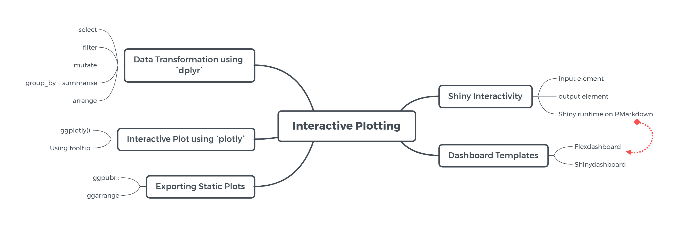

```{r, include=FALSE}
knitr::opts_chunk$set(
  message = FALSE,
  warning = FALSE,
  fig.asp = 0.65,
  fig.align = "center",
  out.width = "60%",
  collapse = TRUE,
  comment = "#>"
)

library(tidyverse)
library(ggthemes)
library(hrbrthemes)
```

# What we have learned?  {data-transition="slide-in fade-out"}

---

## Programming For Data Science

```{r, echo=FALSE, out.width="100%", fig.align="center"}

```

---


## Analyze. Share. Reproduce. with R Markdown

Your data tells a story. Tell it with R Markdown. Turn your analyses into high quality documents, reports, presentations and dashboards.

R Markdown supports dozens of static and dynamic output formats including HTML ⧉, PDF ⧉, MS Word ⧉, Beamer ⧉, HTML5 slides ⧉, Tufte-style handouts ⧉, books ⧉, dashboards, shiny applications ⧉, scientific articles ⧉, websites ⧉, and more.

[See gallery](https://rmarkdown.rstudio.com/gallery.html)

---

## Practical statistics

* Descriptive Statistics
* Inferential statistics

```{r, echo=FALSE, out.width="80%", fig.align="center"}

```

## Data Visualization in R

```{r, echo=FALSE, out.width="100%", fig.align="center"}

```

---

* The Goal of Visualization

**Exploratory**

 to uncover a relationship in the data  
 to *analyze* data

**Explanatory**

 to communicate a relationship in the data  
 to *present* data  

---

* Data with same statistics can be vastly different.

```{r echo=FALSE}
library(kableExtra)
library(lubridate)

vids <- read.csv("data_input/USvideos.csv")
vids$category_id <- sapply(as.character(vids$category_id), switch, 
                           "1" = "Film and Animation",
                           "2" = "Autos and Vehicles", 
                           "10" = "Music", 
                           "15" = "Pets and Animals", 
                           "17" = "Sports",
                           "19" = "Travel and Events", 
                           "20" = "Gaming", 
                           "22" = "People and Blogs", 
                           "23" = "Comedy",
                           "24" = "Entertainment", 
                           "25" = "News and Politics",
                           "26" = "Howto and Style", 
                           "27" = "Education",
                           "28" = "Science and Technology", 
                           "29" = "Nonprofit and Activism",
                           "43" = "Shows")
vids$trending_date <- ydm(vids$trending_date) 
vids$publish_time <- ymd_hms(vids$publish_time, tz = "America/New_York")
vids.unik <- vids[ match(unique(vids$title), vids$title), ]
vids.unik$like_per_view <- vids.unik$likes/vids.unik$views
vids.unik$dislike_per_view <- vids.unik$dislikes/vids.unik$views
vids.unik$comment_per_view <- vids.unik$comment_count/vids.unik$views

vids.selected <- vids.unik[vids.unik$category_id == "Gaming" | 
                           vids.unik$category_id == "Autos and Vehicles" | 
                           vids.unik$category_id == "Travel and Events", ]

kable(vids[1:5,c(1,3,4,6:7)], caption = "Youtube Trending US, 2018")
```

---

<div style="text-align: left">
<font size="6">
Whenever we visualize, we are encoding data using **visual cues**, or mapping data onto variation in **size**, **shape** or **color**, and so on:
</div>
</font>
<hr>
<br>

<style type="text/css">
.twoC {width: 100%}
.clearer {clear: both}
.twoC img {max-width: 50%; float: right}
.twoC img {max-width: 50%; float: left}
</style>

<div class="twoC">

```{r, echo=FALSE,out.width='60%', fig.show='hold'}
library(ggplot2)
library(ggthemes)

ggplot(data = vids.selected, mapping = aes(x = like_per_view,
                                           y = dislike_per_view,
                                           size = comment_per_view)) +
  geom_jitter(aes(color=category_id)) +
  scale_color_viridis_d() +
  labs( title = "Like ratio vs Dislike ratio",
        y = "Dislike ratio",
        x = "Like ratio", 
        color = "Category ID",
        caption = "Youtube Trending, 2018") +
  guides(size = F) + 
  theme_pander() +
  theme(legend.position = "top") 

```


```{r, echo=FALSE, out.width='60%', fig.show='hold'}

library(ggrepel)

data_viz_agg <- aggregate(cbind(like_per_view, dislike_per_view, comment_per_view) ~ channel_title + category_id, 
          data = vids.unik, FUN = mean)
data_viz_spesial <- data_viz_agg[data_viz_agg$comment_per_view > 0.045 |
                                   data_viz_agg$like_per_view > 0.2, ]

ggplot(data = data_viz_agg, aes(x = like_per_view, y = comment_per_view)) +
  geom_point() +
  geom_smooth(method = "lm") +
  geom_label_repel(data = data_viz_spesial, aes(label = channel_title)) +
  labs(title = "Comment Ratio vs Likes Ratio",
       y = "Comment per View",
       x = "Likes per View") +
  theme_pander()
  
```

</div>
<div class="clearer"></div>

---

## Interactive Plotting

```{r, echo=FALSE, out.width="100%", fig.align="center"}

```

---

* **Build web app dashboard**


```{r, echo=FALSE, out.width="80%", fig.align="center"}

```

# Motivational: Why Learn R? {data-transition="zoom"}

## Open Source 

Part of the reason for its active and rapidly growing community is the open-source nature of R. Users can contribute packages--many of which packaged some of the most advanced statistical tools that are not found in other commercial, proprietary statistical computing softwares.

## R does not involve lots of pointing and clicking, and that’s a good thing

The learning curve might be steeper than with other software, but with R, the results of your analysis do not rely on remembering a succession of pointing and clicking, but instead on a series of written commands, and that’s a good thing!

## R works on data of all shapes and sizes

The skills you learn with R scale easily with the size of your dataset. Whether your dataset has hundreds or millions of lines, it won’t make much difference to you. R is designed for data analysis. It comes with special data structures and data types that make handling of missing data and statistical factors convenient. R can connect to spreadsheets, databases, and many other data formats, on your computer or on the web

## Used by Biggest Software Companies in the World

The BBC data team, developed an R package and an R cookbook to make the process of creating publication-ready graphics in their style-guide using R’s ggplot2 library a more reproducible process, as well as making it easier for people new to R to create graphics.


```{r, echo=FALSE, out.width="75%", fig.align="center"}

```


---

R is used by Google to calculate ROI on advertising campaigns and estimate causal effect (say, estimate the impact of an app feature on app downloads or number of additional sales from an AdWords campaign); In fact, it even released its own R packages to allow other R users to do similar analysis using the same tool (see [`CausalImpact`](https://opensource.googleblog.com/2014/09/causalimpact-new-open-source-package.html){target="_blank"}). Data Science employees at Google participate in User Groups to discuss how R is used in Google, publishing [its own R client for the Google Prediction API](https://code.google.com/archive/p/google-prediction-api-r-client/){target="_blank"}, [Google's R style guide](http://web.stanford.edu/class/cs109l/unrestricted/resources/google-style.html){target="_blank"}, and its developers have released a number of R packages over the years.

---

## Ready for Big Data

The [Spark](https://spark.apache.org/){target="_blank"} interface to R ([sparklyr](https://spark.rstudio.com/){target=_blank}), [Microsoft R Open](https://docs.microsoft.com/en-us/machine-learning-server/r-client/what-is-microsoft-r-client){target="_blank"}, some parallelization extension, and a handful of other toolkits adds powerful big data support, allowing data engineers to create custom parallel and distributed algorithms to handle parallel / map-reduce programming in R. This makes R a popular choice for big data analyses, and high performance, enterprise-level analytics platform.

# How to learn more after the workshop?

---

**Use the built in Rstudio help interface to search for more information on R function**

```{r, echo=FALSE, fig.width=6}

```

---

**I’m stuck, I get an error message that I don’t understand `r emojifont::emoji("cry")`**

Start by googling the error message. However, this doesn’t always work very well because often, package developers rely on the error catching provided by R. You end up with general error messages that might not be very helpful to diagnose a problem (e.g. “subscript out of bounds”).

However, you should check Stack Overflow. Search using the [r] tag. Most questions have already been answered, but the challenge is to use the right words in the search to find the answers

--- 

<center> **Hone your skill of data wrangling and visualization by participating on #TidyTuesday on twitter** </center>

```{r, echo=FALSE, fig.width=6}
knitr::include_graphics("assets/tt_logo.png")
```

<center> [Visit the github](https://github.com/rfordatascience/tidytuesday) </center>

--- 

<center> **Explore various kind of Interactive Table and Plotting packages in R** </center>

```{r, echo=FALSE, out.width="100%"}

```

* [*kable and kableExtra*](https://cran.r-project.org/web/packages/kableExtra/vignettes/awesome_table_in_html.html)
* [*DT*](https://rstudio.github.io/DT/)
* [*Plotly*](https://plot.ly/r/)
* [*echart*](https://echarts4r.john-coene.com/)
* [*Highcharter*](http://jkunst.com/highcharter/)

---

<center> **Explore shiny and it's variant** </center>

```{r, echo=FALSE, out.width="100%"}

```

* [*custom shiny with css*](https://shiny.rstudio.com/articles/css.html)
* [*shinydashboardplus*](https://rinterface.github.io/shinydashboardPlus/)
* [*shinywidgets*](https://github.com/dreamRs/shinyWidgets)
* [*Navbar*](https://shiny.rstudio.com/gallery/navbar-example.html)
* [*shinymobile*](https://rinterface.github.io/shinyMobile/)

# Happy Learning and Coding! `r emojifont::emoji("grin")`
